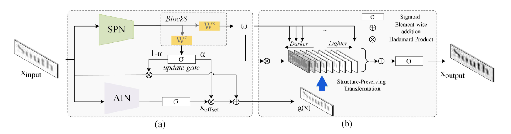

# SPIN: Structure-Preserving Inner Offset Network for Scene Text Recognition

## 目录

- [1. 简介]()
- [2. 数据集和复现精度]()
- [3. 准备数据与环境]()
    - [3.1 准备环境]()
    - [3.2 准备数据]()
    - [3.3 准备模型]()
- [4. 开始使用]()
    - [4.1 模型训练]()
    - [4.2 模型评估]()
    - [4.3 模型预测]()
- [5. 模型推理部署]()
    - [5.1 基于Inference的推理]()
    - [5.2 基于Serving的服务化部署]()
- [6. 自动化测试脚本]()
- [7. LICENSE]()

## 1. 简介

SPIN收录于AAAI2020。主要用于OCR识别任务。在任意形状文本识别中，矫正网络是一种较为常见的前置处理模块，但诸如RARE\ASTER\ESIR等只考虑了空间变换，并没有考虑色度变换。本文提出了一种结构Structure-Preserving Inner Offset Network (SPIN)，可以在色彩空间上进行变换。该模块是可微分的，可以加入到任意识别器中。其网络结构如下图所示
<p align="center">
 
<p align="center">

**论文:** [SPIN: Structure-Preserving Inner Offset Network for Scene Text Recognition](https://arxiv.org/abs/2005.13117)

**参考repo:** [
DAVAR-Lab-OCR](https://github.com/hikopensource/DAVAR-Lab-OCR/blob/main/demo/text_recognition/spin/readme.md)

在此非常感谢[
DAVAR-Lab-OCR](https://github.com/hikopensource/DAVAR-Lab-OCR/blob/main/demo/text_recognition/spin/readme.md)，提高了本repo复现论文的效率。

本复现采用[ppocr](https://github.com/PaddlePaddle/PaddleOCR)，感谢ppocr的开发者。

**aistudio体验教程:** [后续将添加](url)


## 2. 数据集和复现精度

本复现采用的训练数据集和测试数据集参考[DAVAR-Lab-OCR](https://github.com/hikopensource/DAVAR-Lab-OCR/blob/main/demo/text_recognition/spin/readme.md)。详细信息如下表所示

| Dataset | Samples |
| ------- | ------- |
| MJSynth | 8919257 |
| SynText | 7266164 |


本复现的效果如下
|        | 数据集   | IIIT5K | SVT  | IC03 | IC13 | IC15 | SVTP | CT80 | Avg   |
| -------| ------- | -----  | ---- | ---- | ---- | ---- | ---- | ----- | ----- |
| 参考   | MJ + ST |  94.6  | 89.0 | 93.3 | 94.2 | 80.7 | 83.0 | 84.7 | 88.5   |
| 复现   | MJ + ST |  94.9  | 90.6 | 95.8 | 96.3 | 81.0 | 85.4 | 86.1 | 90.0   |

模型链接稍后将给出


## 3. 准备环境与数据


### 3.1 准备环境

- 框架：
  - PaddlePaddle >= 2.2.2
- 安装方式
直接使用pip进行安装
`pip install paddlepaddle-gpu`
paddlepaddle安装成功后，使用pip install -r requirements.txt安装依赖。
具体环境配置可参考[ppocr](https://github.com/PaddlePaddle/PaddleOCR)

### 3.2 准备数据

使用的数据集已在AIStudio上公开，地址如下
由于数据较大，数据分为两个part存储。地址为[part1](https://aistudio.baidu.com/aistudio/datasetdetail/146977)， [part2](https://aistudio.baidu.com/aistudio/datasetdetail/146978)。训练时只需将其全部解压到一个文件夹下即可。其中[part2](https://aistudio.baidu.com/aistudio/datasetdetail/146978)包含了测试集evaluation_spin.zip
为方便存储，所有数据都已经打包成lmdb格式。

## 4. 开始使用

本复现基于PaddleOCR框架，需要进行部分修改，主要是加入SPIN数据预处理，gaspin_transfomer,backbone, cascade_rnn和rec_spin_head，以及在训练和评估脚本中加入SPIN字段。详细介绍如下：
- 数据读取与预处理
SPIN将图片转为灰度图，读取方式可复用NRTRDecodeImage
在./ppocr/data/imaug/rec_img_aug.py中加入了`SPINRecResizeImg`
在./ppocr/data/imaug/label_ops.py中加入了`SPINAttnLabelEncode`
-transforms
加入gaspin_transformer.py
- backbone
加入rec_resnet_32.py
- necks
在./ppocr/modeling/necks/rnn.py中加入EncoderWithCascadeRNN
- head
加入./ppocr/modeling/heads/rec_spin_att_head.py
- loss
加入rec_spin_att_loss.py


整体训练流程与PaddleOCR一致，可参考PaddleOCR的流程，下面进行简述。
### 4.1 模型训练
- 修改配置文件，配置文件地址为configs/rec/rec_r32_gaspin_bilstm_att.yml

注意：在模型训练前，请先修改配置文件中的data_dir。
```
# GPU训练 支持单卡，多卡训练

#单卡训练（训练周期长，不建议）
python3 tools/train.py -c configs/rec/rec_r32_gaspin_bilstm_att.yml

#多卡训练，通过--gpus参数指定卡号
python3 -m paddle.distributed.launch --gpus '0,1,2,3'  tools/train.py -c configs/rec/rec_r32_gaspin_bilstm_att.yml
```
根据配置文件中设置的的 `save_model_dir` 和 `save_epoch_step` 字段，会有以下几种参数被保存下来：
```
output/rec/
├── best_accuracy.pdopt  
├── best_accuracy.pdparams  
├── best_accuracy.states  
├── config.yml  
├── iter_epoch_3.pdopt  
├── iter_epoch_3.pdparams  
├── iter_epoch_3.states  
├── latest.pdopt  
├── latest.pdparams  
├── latest.states  
└── train.log
```
其中 best_accuracy.* 是评估集上的最优模型；iter_epoch_x.* 是以 `save_epoch_step` 为间隔保存下来的模型；latest.* 是最后一个epoch的模型。

本复现训练好的模型权重及训练日志地址为(链接：), 下载完成后，将rec_r32_gaspin_bilstm_att_submit.zip文件解压，然后文件夹里面的文件全部拷贝到./inference/rec_r32_gaspin_bilstm_att,以方便后续部署

### 4.2 模型评估

评估数据集可以通过 configs/rec/rec_r32_gaspin_bilstm_att.yml 修改Eval中的 data_dir 设置。
```
# GPU 评估， Global.checkpoints 为待测权重
python3 -m paddle.distributed.launch --gpus '0' tools/eval.py -c configs/rec/rec_r32_gaspin_bilstm_att.yml -o Global.checkpoints=./inference/rec_r32_gaspin_bilstm_att/best_accuracy
```
评估日志存储在./log中
### 4.3 模型预测

使用 PaddleOCR 训练好的模型，可以通过以下脚本进行快速预测。

默认预测图片存储在配置文件的 `infer_img` 字段里，通过`Global.infer_img`进行修改。通过 `-o Global.checkpoints` 加载训练好的参数文件：
```
python3 tools/infer_rec.py -c configs/rec/rec_r32_gaspin_bilstm_att.yml -o Global.pretrained_model=./inference/rec_r32_gaspin_bilstm_att/best_accuracy Global.load_static_weights=false Global.infer_img=./inference/rec_inference/word_1.png
```
预测图片：

得到输入图像的预测结果：

```
infer_img: doc/imgs_words/en/word_1.png
        result: ('joint', 0.9853365)
```
## 5. 模型推理部署

将动态模型转为静态模型

```
# -c 后面设置训练算法的yml配置文件
# -o 配置可选参数
# Global.pretrained_model 参数设置待转换的训练模型地址，不用添加文件后缀 .pdmodel，.pdopt或.pdparams。
# Global.save_inference_dir参数设置转换的模型将保存的地址。

python3 tools/export_model.py -c configs/rec/rec_r32_gaspin_bilstm_att.yml -o Global.pretrained_model=./inference/rec_r32_gaspin_bilstm_att/best_accuracy  Global.save_inference_dir=./inference/rec_r32_gaspin_bilstm_att
```
转换成功后，在目录下有三个文件：
```
/inference/rec_r32_gaspin_bilstm_att/
    ├── inference.pdiparams         # 识别inference模型的参数文件
    ├── inference.pdiparams.info    # 识别inference模型的参数信息，可忽略
    └── inference.pdmodel           # 识别inference模型的program文件
```
- 自定义模型推理

  ```
  python3 tools/infer/predict_rec.py --image_dir=./inference/rec_inference/word_1.png --rec_model_dir=./inference/rec_r32_gaspin_bilstm_att --rec_image_shape="3, 32, 100" --rec_char_dict_path=./ppocr/utils/dict/spin_dict.txt --use_space_char=False --rec_algorithm="SPIN"
  ```

## 6. 自动化测试脚本

飞桨除了基本的模型训练和预测，还提供了训推一体全流程（Training and Inference Pipeline Criterion(TIPC)）信息和测试工具，方便用户查阅每种模型的训练推理部署打通情况，并可以进行一键测试。
测试单项功能仅需两行命令，**如需测试不同模型/功能，替换配置文件即可**，命令格式如下：
```shell
# 功能：准备数据
# 格式：bash + 运行脚本 + 参数1: 配置文件选择 + 参数2: 模式选择
bash test_tipc/prepare.sh  configs/[model_name]/[params_file_name]  [Mode]

# 功能：运行测试
# 格式：bash + 运行脚本 + 参数1: 配置文件选择 + 参数2: 模式选择
bash test_tipc/test_train_inference_python.sh configs/[model_name]/[params_file_name]  [Mode]
```


更多信息可查看[基础训练预测使用文档](https://github.com/PaddlePaddle/PaddleOCR/blob/dygraph/test_tipc/docs/test_train_inference_python.md#22-%E5%8A%9F%E8%83%BD%E6%B5%8B%E8%AF%95)。

关于本复现，tipc配置文件已经给出
test_tipc/configs/rec_r32_gaspin_bilstm_att，可以通过查看train_infer_python.txt的内容来了解tipc的具体流程和配置。


```shell
# 准备数据
bash test_tipc/prepare.sh ./test_tipc/configs/rec_r32_gaspin_bilstm_att/train_infer_python.txt 'lite_train_lite_infer'
# 运行lite_train_lite_infer模式，
bash test_tipc/test_train_inference_python.sh ./test_tipc/configs/rec_r32_gaspin_bilstm_att/train_infer_python.txt 'lite_train_lite_infer'
```

## 7. LICENSE

本项目的发布受[Apache 2.0 license](./LICENSE)许可认证。
